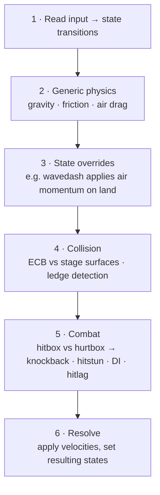

# Mechanics model

This is where "many small mechanics interacting" becomes deep gameplay — and
where most of the engine's development time will go. The depth in Melee-like
games is **emergent**: techniques like wavedashing and ledgedashing were never
explicitly programmed. They fall out of simple rules interacting.

## Fighters are state machines

Each fighter is an **action-state machine**, exactly like Melee's action-state
IDs. A character is always in exactly one state, and states define what's
possible.

```rust title="ActionState (design sketch)"
#[derive(Clone, Copy, PartialEq, Eq)]
pub enum ActionState {
    Idle,
    Walk,
    Dash,
    Jumpsquat,
    Airborne,
    Attack(AttackId),
    Shield,
    Hitstun,
    LedgeHang,
    // ...dozens more
}
```

!!! tip "Rust enums make this natural"

    Coming from C#, the state machine maps cleanly onto Rust `enum`s plus
    `match`. Each state's per-frame behavior is just an arm of a `match`.

## Frame data drives each state

Each state is described by **data tables**, not code: which frames have active
hitboxes, the earliest frame you can act out of it (IASA), animation timing, and
so on. Keeping this as data is what makes the game tunable without recompiling
logic.

```rust title="frame data is plain data"
pub struct AttackData {
    pub startup: u8,             // frames before the first active hitbox
    pub active: Range<u8>,       // frames the hitbox is live
    pub iasa: u8,               // interruptible-as-soon-as frame
    pub hitboxes: Vec<Hitbox>,   // damage, angle, knockback growth/base...
}
```

## The layered update order

Every tick, each fighter is updated through an explicit, **deterministic**
sequence of layers. Mechanics compose because later layers can override earlier
ones — and the *order* is fixed so the result is reproducible.



1. **Input → transitions.** The current state decides which inputs are valid and
   what they transition to.
2. **Generic physics.** Gravity, ground friction, and air drag applied uniformly
   in fixed-point.
3. **State overrides.** The active state can modify the generic result — this is
   where signature mechanics live.
4. **Collision.** The character's **ECB** (environmental collision box) is
   resolved against stage surfaces; ledges are detected here.
5. **Combat.** Active hitboxes are tested against opponent hurtboxes; on hit,
   compute knockback (Melee's knockback formula), hitstun, DI, and hitlag.
6. **Resolve.** Apply the accumulated velocity changes and commit new states.

## Why emergence works

Consider the wavedash, which nobody programs directly:

- *Air dodge* is a state with a directional momentum burst (layer 3).
- *Diagonal-into-ground* means that burst's downward component meets a surface
  during collision (layer 4).
- *Landing* converts the remaining horizontal momentum into a slide governed by
  ordinary ground friction (layers 2 + 6).

Three independent mechanics, in a fixed order, produce a technique with its own
skill curve. The engine's job is to keep each mechanic **small, orthogonal, and
deterministically ordered** — depth takes care of itself.

## Data layout: skip the ECS at first

A full ECS is tempting, but a plain `World` struct with arrays gives total
control over state layout — which is exactly what cheap rollback snapshots want.
Reach for a lightweight ECS like [`hecs`](https://docs.rs/hecs) only if a later
need justifies it.
