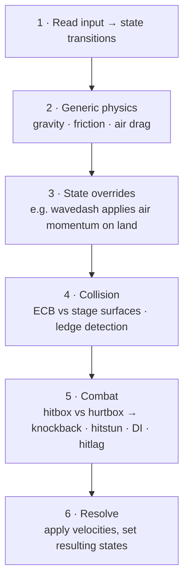

# Mechanics model

Depth in Melee-like games is **emergent**. Nobody programmed wavedashing or
ledgedashing; they fall out of small mechanics interacting in a fixed order.
Most of the engine's development time will go here. Today the engine holds a
minimal slice, and this page keeps that slice apart from the design it grows
into.

## What runs today

`step_fighter` advances one fighter by one tick. It is the whole mechanics
model so far, and its six numbered steps are a first cut of the layer order
below.

```rust title="crates/pf_core/src/systems/mod.rs"
/// Advance a single fighter by one tick. Pure: depends only on its inputs.
pub fn step_fighter(f: &mut Fighter, input: Input, stage: &Stage) {
    // 1. Input → horizontal velocity.
    let dir = Fx::from_num(input.stick_x as i32) / STICK_MAX;
    f.vel.x = dir * MOVE_SPEED;
    if dir > Fx::ZERO {
        f.facing_right = true;
    } else if dir < Fx::ZERO {
        f.facing_right = false;
    }

    let on_ground = f.pos.y <= stage.floor_y;

    // 2. Jump (a state override on the generic physics below).
    if on_ground && input.pressed(buttons::JUMP) {
        f.vel.y = JUMP_VELOCITY;
    }

    // 3. Generic physics: gravity while airborne.
    if !on_ground {
        f.vel.y -= GRAVITY;
    }

    // 4. Integrate.
    f.pos = f.pos + f.vel;

    // 5. Collision against the stage.
    if f.pos.y < stage.floor_y {
        f.pos.y = stage.floor_y;
        if f.vel.y < Fx::ZERO {
            f.vel.y = Fx::ZERO;
        }
    }
    if f.pos.x < stage.left {
        f.pos.x = stage.left;
    }
    if f.pos.x > stage.right {
        f.pos.x = stage.right;
    }

    // 6. Resolve the action state label.
    f.state = if f.pos.y <= stage.floor_y {
        ActionState::Idle
    } else {
        ActionState::Airborne
    };
}
```

The function is pure: it reads the fighter, its input, and the stage, and
nothing else. That is what lets `World::advance` call it for each fighter in
turn and stay pure itself. The stick sets velocity directly every tick, with
no acceleration. Gravity applies only in the air. The stage is a flat floor
with a wall at each end.

`ActionState` has four variants, and `step_fighter` sets two of them:

```rust title="crates/pf_core/src/world.rs"
pub enum ActionState {
    Idle,
    Walk,
    Airborne,
    Hitstun,
}
```

`Walk` and `Hitstun` are declared for the shape to come; nothing sets them
yet.

## The layered update order

Each tick, every fighter passes through a fixed sequence of layers. Later
layers can override earlier ones, which is how mechanics compose, and the
order never changes, which is what makes the result reproducible.


```mermaid
flowchart TB
  I[1 · Read input → state transitions] --> P[2 · Generic physics<br/>gravity · friction · air drag]
  P --> O[3 · State overrides<br/>e.g. wavedash applies air momentum on land]
  O --> C[4 · Collision<br/>ECB vs stage surfaces · ledge detection]
  C --> H[5 · Combat<br/>hitbox vs hurtbox → knockback · hitstun · DI · hitlag]
  H --> R[6 · Resolve<br/>apply velocities, set resulting states]
```

1. **Input → transitions.** The current state decides which inputs are valid
   and what they transition to.
2. **Generic physics.** Gravity, ground friction, and air drag, applied
   uniformly in fixed point.
3. **State overrides.** The active state modifies the generic result. This is
   where signature mechanics live.
4. **Collision.** The character's **ECB** (environmental collision box) is
   resolved against stage surfaces, and ledges are detected.
5. **Combat.** Active hitboxes are tested against opponent hurtboxes. On a
   hit, the layer computes knockback (Melee's formula), hitstun, DI, and
   hitlag.
6. **Resolve.** The accumulated velocity changes apply and the new states are
   committed.

`step_fighter` is a first cut of this order, not a copy of it. Its collision
runs before the state label is resolved, as layers 4 and 6 require. Its jump,
the one state override so far, runs *before* gravity rather than after, but
the order does not matter yet: the jump needs the fighter on the ground and
gravity needs it in the air, so the two never run in the same tick. Combat,
layer 5, arrives in Phase 5.

## Why emergence works

Take the wavedash, which nobody programs directly:

- *Air dodge* is a state with a directional momentum burst (layer 3).
- *Diagonal-into-ground* means that burst's downward component meets a
  surface during collision (layer 4).
- *Landing* turns the remaining horizontal momentum into a slide governed by
  ordinary ground friction (layers 2 and 6).

Three independent mechanics, run in a fixed order, produce a technique with
its own skill curve. The engine's job is to keep each mechanic small,
orthogonal, and in its fixed place; the depth follows.

## Fighters as state machines

!!! note "Decided, not built"

    Each fighter is an **action-state machine**, like Melee's action-state
    IDs. A fighter is always in exactly one state, and that state defines
    what it can do. A Rust `enum` plus `match` expresses this directly, one
    arm per state, and the four-variant stub above grows into it.

    ```rust title="design sketch"
    pub enum ActionState {
        Idle,
        Walk,
        Dash,
        Jumpsquat,
        Airborne,
        Attack(AttackId),
        Shield,
        Hitstun,
        LedgeHang,
        // ...dozens more
    }
    ```

    Each state is described by **frame data**, not code: which frames have
    active hitboxes, the earliest frame the fighter can act out of it (IASA),
    and animation timing. Keeping this as data makes the game tunable without
    recompiling logic.

    ```rust title="design sketch"
    pub struct AttackData {
        pub startup: u8,             // frames before the first active hitbox
        pub active: Range<u8>,       // frames the hitbox is live
        pub iasa: u8,                // interruptible-as-soon-as frame
        pub hitboxes: Vec<Hitbox>,   // damage, angle, knockback growth/base...
    }
    ```

## Data layout: a plain struct, not an ECS

`World` is a struct holding a `Vec<Fighter>`, on purpose. A full ECS is
tempting, but a plain struct gives total control over state layout, and
control over layout is what a cheap rollback snapshot needs (see
[one flat, serializable world](deterministic-core.md#3-one-flat-serializable-world)).
A lightweight ECS such as [`hecs`](https://docs.rs/hecs) is the alternative
held in reserve, for a later need that justifies it. The engine also has no
general-purpose physics engine; the
[overview](overview.md#what-pfengine-deliberately-does-not-use) says why.
