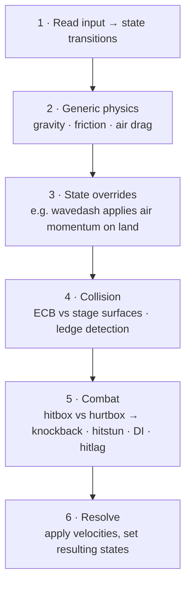

# Mechanics model

Depth in Melee-like games is **emergent**: wavedashing and ledgedashing were
never programmed. They fall out of small mechanics interacting in a fixed
order. This is where most of the engine's development time will go; today it
holds a minimal slice, and this page separates that slice from the design it
grows into.

## What runs today

`step_fighter` advances one fighter by one tick. It is the whole mechanics
model so far, and its six numbered steps are the first cut of the layer order
below.

```rust title="crates/pf_core/src/systems/mod.rs"
/// Advance a single fighter by one tick. Pure: depends only on its inputs.
pub fn step_fighter(f: &mut Fighter, input: Input, stage: &Stage) {
    // 1. Input → horizontal velocity.
    let dir = Fx::from_num(input.stick_x as i32) / STICK_MAX;
    f.vel.x = dir * MOVE_SPEED;
    if dir > Fx::ZERO {
        f.facing_right = true;
    } else if dir < Fx::ZERO {
        f.facing_right = false;
    }

    let on_ground = f.pos.y <= stage.floor_y;

    // 2. Jump (a state override on the generic physics below).
    if on_ground && input.pressed(buttons::JUMP) {
        f.vel.y = JUMP_VELOCITY;
    }

    // 3. Generic physics: gravity while airborne.
    if !on_ground {
        f.vel.y -= GRAVITY;
    }

    // 4. Integrate.
    f.pos = f.pos + f.vel;

    // 5. Collision against the stage.
    if f.pos.y < stage.floor_y {
        f.pos.y = stage.floor_y;
        if f.vel.y < Fx::ZERO {
            f.vel.y = Fx::ZERO;
        }
    }
    if f.pos.x < stage.left {
        f.pos.x = stage.left;
    }
    if f.pos.x > stage.right {
        f.pos.x = stage.right;
    }

    // 6. Resolve the action state label.
    f.state = if f.pos.y <= stage.floor_y {
        ActionState::Idle
    } else {
        ActionState::Airborne
    };
}
```

The function is pure: it reads the fighter, its input, and the stage, and
nothing else, which is what lets `World::advance` call it per fighter in order
and stay a pure function itself. Velocity is set from the stick every tick with
no acceleration, gravity applies only in the air, and the stage is a flat
floor with two walls.

`ActionState` has four variants, and `step_fighter` sets two of them:

```rust title="crates/pf_core/src/world.rs"
pub enum ActionState {
    Idle,
    Walk,
    Airborne,
    Hitstun,
}
```

`Walk` and `Hitstun` are declared for the shape to come; nothing sets them yet.

## The layered update order

Every tick, each fighter passes through an explicit sequence of layers. Later
layers can override earlier ones, which is how mechanics compose, and the order
is fixed, which is what makes the result reproducible.


```mermaid
flowchart TB
  I[1 · Read input → state transitions] --> P[2 · Generic physics<br/>gravity · friction · air drag]
  P --> O[3 · State overrides<br/>e.g. wavedash applies air momentum on land]
  O --> C[4 · Collision<br/>ECB vs stage surfaces · ledge detection]
  C --> H[5 · Combat<br/>hitbox vs hurtbox → knockback · hitstun · DI · hitlag]
  H --> R[6 · Resolve<br/>apply velocities, set resulting states]
```

1. **Input → transitions.** The current state decides which inputs are valid
   and what they transition to.
2. **Generic physics.** Gravity, ground friction, and air drag, applied
   uniformly in fixed point.
3. **State overrides.** The active state modifies the generic result; this is
   where signature mechanics live.
4. **Collision.** The character's **ECB** (environmental collision box) is
   resolved against stage surfaces; ledges are detected here.
5. **Combat.** Active hitboxes are tested against opponent hurtboxes; on hit,
   compute knockback (Melee's formula), hitstun, DI, and hitlag.
6. **Resolve.** Apply the accumulated velocity changes and commit new states.

`step_fighter` already follows this shape with the combat layer missing: its
jump is a state override on the gravity below it, and its collision runs before
the state label is resolved. Layer 5 arrives in Phase 5.

## Why emergence works

Consider the wavedash, which nobody programs directly:

- *Air dodge* is a state with a directional momentum burst (layer 3).
- *Diagonal-into-ground* means that burst's downward component meets a surface
  during collision (layer 4).
- *Landing* converts the remaining horizontal momentum into a slide governed by
  ordinary ground friction (layers 2 and 6).

Three independent mechanics, in a fixed order, produce a technique with its own
skill curve. The engine's job is to keep each mechanic small, orthogonal, and
deterministically ordered; depth takes care of itself.

## Fighters as state machines

!!! note "Decided, not built"

    Each fighter is an **action-state machine**, like Melee's action-state IDs:
    always in exactly one state, and the state defines what is possible. A
    Rust `enum` plus `match` carries this directly, one arm per state, and the
    four-variant stub above grows into it.

    ```rust title="design sketch"
    pub enum ActionState {
        Idle,
        Walk,
        Dash,
        Jumpsquat,
        Airborne,
        Attack(AttackId),
        Shield,
        Hitstun,
        LedgeHang,
        // ...dozens more
    }
    ```

    Each state is described by **frame data**, not code: which frames have
    active hitboxes, the earliest frame you can act out of it (IASA), and
    animation timing. Keeping this as data is what makes the game tunable
    without recompiling logic.

    ```rust title="design sketch"
    pub struct AttackData {
        pub startup: u8,             // frames before the first active hitbox
        pub active: Range<u8>,       // frames the hitbox is live
        pub iasa: u8,                // interruptible-as-soon-as frame
        pub hitboxes: Vec<Hitbox>,   // damage, angle, knockback growth/base...
    }
    ```

## Data layout: a plain struct, not an ECS

`World` is a struct with a `Vec<Fighter>`, and that is deliberate. A full ECS is
tempting, but a plain struct gives total control over state layout, which is
exactly what a cheap rollback snapshot wants (see
[one flat, serializable world](deterministic-core.md#3-one-flat-serializable-world)).
A lightweight ECS such as [`hecs`](https://docs.rs/hecs) is the alternative
kept in reserve for a later need that justifies it. For the same reason the
engine has no general-purpose physics engine; the
[overview](overview.md#what-pfengine-deliberately-does-not-use) says why.
