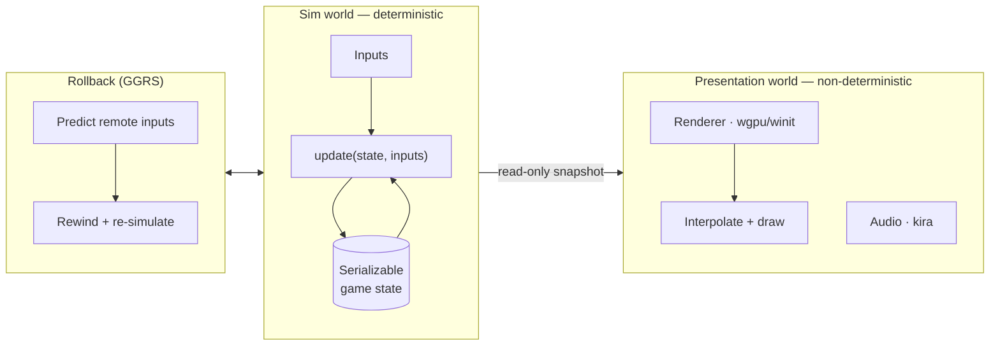

# Architecture overview

pfengine is organized around a single idea: **two worlds that touch in only one
direction.**



## The sim world

Fixed-point math, a fixed **60 Hz** timestep, fully serializable state. This is
the engine's brain and the thing rollback re-runs. It knows nothing about the
screen, the OS, or the clock.

- Input in, new state out — a pure function.
- Cloning the entire state is cheap (it's flat, contiguous data).
- Identical on every platform, down to the bit.

## The presentation world

Rendering, audio, particles, screen shake, and all the "juice." It runs as fast
as the display refresh and is free to use floats, the system clock, and
anything else — because nothing here ever feeds back into the simulation.

Each frame it reads the latest two sim states and **interpolates** between them
by the fractional time since the last tick, so a 60 Hz simulation renders
smoothly at any refresh rate.

## Why the boundary is enforced by the compiler

The split isn't just a convention — it's encoded in the crate structure so that
determinism-breaking code *cannot compile* inside the core:

```
pfengine/
├── Cargo.toml                # [workspace]
└── crates/
    ├── pf_core/src/          # deterministic sim — NO rendering, NO std::time, NO f32
    │   ├── math/             #   fixed-point Fx + V2, deterministic RNG (LUT trig later)
    │   ├── world.rs          #   the serializable game state
    │   ├── systems/          #   physics, collision, mechanics
    │   └── input.rs          #   the per-player input struct
    ├── pf_net/               # GGRS config + SyncTest gate (matchbox transport later)
    ├── pf_render/            # macroquad today, wgpu + winit later; interpolation
    └── pf_app/               # desktop / web entry point, input sources, slot binding
```

!!! info "Determinism wall"

    `pf_core` deliberately has **zero** rendering or OS dependencies. If it
    can't *see* `std::time` or `f32`, you can't accidentally use them in the
    simulation. All platform-specific code lives in `pf_app`, behind
    `#[cfg(target_arch = "wasm32")]` and friends.

## What pfengine deliberately does *not* use

A general-purpose rigid-body physics engine (Box2D, Rapier, PhysX). Melee-style
"physics" isn't rigid-body simulation — it's a bespoke collection of
state-machine-driven mechanics. General engines are non-deterministic and model
the wrong thing. See [Mechanics model](mechanics.md).

## Reading order

1. [Deterministic core](deterministic-core.md)
2. [Rollback netcode](rollback.md)
3. [Mechanics model](mechanics.md)
