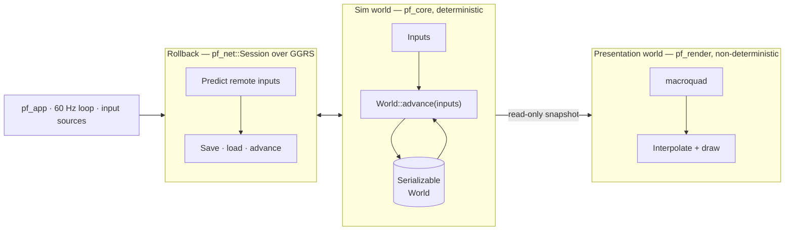

# Architecture overview

pfengine is four crates built around one idea: **two worlds that touch in one
direction only.** The simulation is deterministic and knows nothing about the
screen. The presentation reads the simulation and never writes back.


```mermaid
flowchart LR
  subgraph SIM["Sim world — pf_core, deterministic"]
    direction TB
    I[Inputs] --> U["World::advance(inputs)"]
    U --> S[(Serializable<br/>World)]
    S --> U
  end
  subgraph NET["Rollback — pf_net::Session over GGRS"]
    direction TB
    P[Predict remote inputs] --> RB[Save · load · advance]
  end
  subgraph PRES["Presentation world — pf_render, non-deterministic"]
    direction TB
    R[macroquad] --> X[Interpolate + draw]
  end
  APP[pf_app · 60 Hz loop · input sources] --> NET
  NET <--> SIM
  SIM -->|read-only snapshot| PRES
```

## The sim world

`pf_core` holds fixed-point math, a 60 Hz tick, and one `Clone`-able `World`.
`World::advance` is a pure function: inputs in, next state out. Rollback
re-runs it, so it must produce the same bits on every platform, and it cannot
know about the screen, the OS, or the clock. The
[deterministic core](deterministic-core.md) page covers how.

## The presentation world

`pf_render` draws with macroquad. Each frame it reads the current and the
previous `World` and interpolates positions by the fraction of a tick that has
elapsed, so the 60 Hz simulation renders smoothly at any refresh rate. It may
convert `Fx` to `f32` and read the clock, because nothing here feeds back into
the sim. Audio, particles, and screen shake belong here too; none exist yet.

## The rollback layer

`pf_net` owns the GGRS session that `pf_app` drives every tick, and the
SyncTest gate that CI runs. Local play is the all-local case of that session,
which is why the session exists before the network does. See
[Rollback netcode](rollback.md).

## The platform layer

`pf_app` holds everything that depends on the platform: the fixed-timestep
loop, the input sources and slot binding, the `--players` flag, and the
wasm-only pieces. It is the only crate that polls input devices or carries a
platform `cfg`.

## Where the boundary is enforced

```
pfengine/
├── Cargo.toml                # [workspace]; overflow-checks stay on in release
└── crates/
    ├── pf_core/src/          # deterministic sim — depends on `fixed` + `serde` only
    │   ├── math/             #   fixed-point Fx + V2, deterministic Rng
    │   ├── world.rs          #   the serializable World, advance(), checksum()
    │   ├── systems/          #   step_fighter: the mechanics slice
    │   └── input.rs          #   the per-player Input
    ├── pf_net/               # Session (GGRS) + the SyncTest gate; matchbox later
    ├── pf_render/            # macroquad today, wgpu + winit later; interpolation
    └── pf_app/               # 60 Hz loop, input sources, slot binding, wasm_entropy.rs
```

Dependency lists and one rule about `cfg` hold the boundary. The compiler does
not check it on types:

- **`pf_core` depends on `fixed` and `serde` only.** Nothing pulls in a
  renderer, an OS clock, or float-based math. But `pf_core` still has `std`,
  so "no `f32`, no `std::time`" is a review rule, not a compile error. The
  [table on the deterministic core page](deterministic-core.md#what-catches-a-violation)
  says which guard catches which slip.
- **Only `pf_app` carries `#[cfg(target_arch = ...)]` or
  `#[cfg(target_os = ...)]`.** `pf_core`, `pf_net`, and `pf_render` are
  platform-neutral, which keeps the web build from forking the engine. The
  one platform-specific file today is `crates/pf_app/src/wasm_entropy.rs`.
- **Rendering stops at `pf_render`.** `pf_render` depends on `pf_core`, never
  the reverse, and only `pf_app` depends on all three crates. The sim cannot
  reach the screen even by accident.

## What pfengine deliberately does *not* use

pfengine has no general-purpose rigid-body physics engine (Box2D, Rapier,
PhysX). Melee-style "physics" is not rigid-body simulation. It is a bespoke
set of mechanics driven by a state machine. General engines are
non-deterministic and model the wrong thing. See
[Mechanics model](mechanics.md).

## Reading order

1. [Deterministic core](deterministic-core.md)
2. [Rollback netcode](rollback.md)
3. [Mechanics model](mechanics.md)
