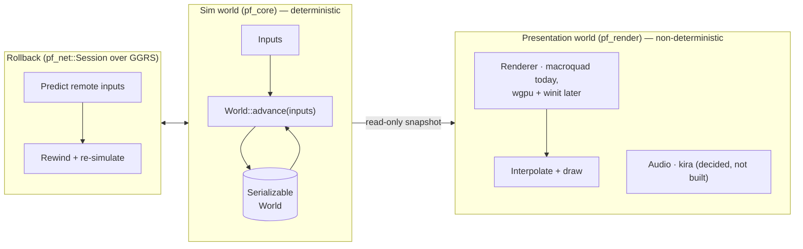

# Architecture overview

pfengine is organized around a single idea: **two worlds that touch in only
one direction.** The sim world computes the game and knows nothing about the
screen. The presentation world reads the sim and never writes back. Four
crates carry the split.


```mermaid
flowchart LR
  subgraph SIM["Sim world (pf_core) — deterministic"]
    direction TB
    I[Inputs] --> U["World::advance(inputs)"]
    U --> S[(Serializable<br/>World)]
    S --> U
  end
  subgraph NET["Rollback (pf_net::Session over GGRS)"]
    direction TB
    P[Predict remote inputs] --> RB[Rewind + re-simulate]
  end
  subgraph PRES["Presentation world (pf_render) — non-deterministic"]
    direction TB
    R["Renderer · macroquad today,<br/>wgpu + winit later"] --> X[Interpolate + draw]
    A["Audio · kira (decided, not built)"]
  end
  NET <--> SIM
  SIM -->|read-only snapshot| PRES
```

## The sim world

`pf_core` holds fixed-point math, a fixed **60 Hz** timestep, and one fully
serializable `World`. It is the engine's brain and the thing rollback
re-runs. It knows nothing about the screen, the OS, or the clock.

- Input in, new state out: `World::advance` is a pure function.
- Cloning the entire state is cheap, because it is flat, contiguous data.
- The result is identical on every platform, down to the bit.

The [deterministic core](deterministic-core.md) page covers how each of
these holds.

## The presentation world

The presentation world is rendering, audio, particles, screen shake, and all
the other "juice". It runs as fast as the display refreshes, and it is free
to use floats, the system clock, and anything else, because nothing in it
ever feeds back into the simulation.

Each frame it reads the latest two sim states and **interpolates** between
them by the fraction of a tick that has passed since the last one. That is
how a 60 Hz simulation renders smoothly at any refresh rate. In code,
`pf_app` keeps the previous `World` and calls
`pf_render::draw_world(&world, &prev, alpha)`, which converts `Fx` to `f32`
and interpolates each fighter's position.

Today `pf_render` draws with macroquad: a floor line and one rectangle per
fighter. Audio, particles, and screen shake do not exist yet.

## The rollback layer

`pf_net` owns the GGRS session that `pf_app` drives every tick, and the
SyncTest gate that CI runs. Local play is the all-local case of that
session, which is why the session exists before the network does. See
[Rollback netcode](rollback.md).

## The platform layer

`pf_app` is the entry point. It holds everything that depends on the
platform: the 60 Hz fixed-timestep loop, the input sources and slot binding,
the `--players` flag, and the one wasm-only module. It is the only crate that
polls an input device or carries a platform `cfg`.

## Where the boundary is enforced

The split is encoded in the crate structure:

```
pfengine/
├── Cargo.toml                # [workspace]; release keeps overflow-checks on
└── crates/
    ├── pf_core/src/          # deterministic sim — NO rendering, NO std::time, NO f32
    │   ├── math/             #   fixed-point Fx + V2, deterministic Rng (LUT trig later)
    │   ├── world.rs          #   the serializable game state: World, advance(), checksum()
    │   ├── systems/          #   physics, collision, mechanics (step_fighter today)
    │   └── input.rs          #   the per-player Input struct
    ├── pf_net/               # GGRS Session + SyncTest gate (matchbox transport later)
    ├── pf_render/            # macroquad today, wgpu + winit later; interpolation
    └── pf_app/               # desktop / web entry point, input sources, slot binding
```

!!! info "Determinism wall"

    `pf_core` deliberately has **zero** rendering or OS dependencies. Its
    `Cargo.toml` lists `fixed` and `serde` and nothing else, under a comment
    that calls the list "the determinism wall". All platform-specific code
    lives in `pf_app`, behind `#[cfg(target_arch = "wasm32")]` and friends.

The wall is a dependency list and a rule, not a compiler check. `pf_core`
still has `std`, so the compiler would accept `f32` or `std::time` there.
Four things keep them out:

- **The dependency list.** `pf_core` depends on `fixed` and `serde` only, so
  nothing pulls in a renderer, an OS clock, or a float-based crate.
- **The `cfg` rule.** Only `pf_app` carries `#[cfg(target_arch = ...)]` or
  `#[cfg(target_os = ...)]`. Today that is one line, the declaration of
  `crates/pf_app/src/wasm_entropy.rs`.
- **The direction of dependencies.** `pf_render` and `pf_net` depend on
  `pf_core`, never the reverse, and only `pf_app` depends on all three. The
  sim cannot reach the screen even by accident.
- **Review and SyncTest.** The
  [determinism checklist](deterministic-core.md#determinism-checklist) is the
  review list, and SyncTest catches what changes a re-simulated frame's
  checksum.

## What pfengine deliberately does *not* use

pfengine uses no general-purpose rigid-body physics engine (Box2D, Rapier,
PhysX). Melee-style "physics" isn't rigid-body simulation. It is a bespoke
collection of mechanics driven by state machines. General engines are
non-deterministic, and they model the wrong thing. See
[Mechanics model](mechanics.md).

## Reading order

1. [Deterministic core](deterministic-core.md)
2. [Rollback netcode](rollback.md)
3. [Mechanics model](mechanics.md)
