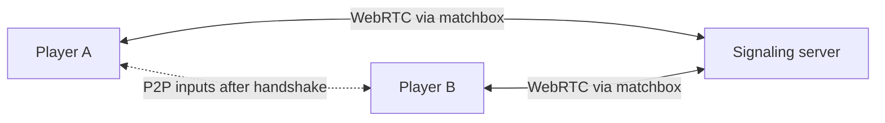

# Rollback netcode

Rollback netcode hides latency by **predicting** remote inputs and playing the
game immediately, then **rewinding and re-simulating** when the real inputs
arrive. Done right, both players feel like they're playing offline. It is the
requirement that shaped the entire [deterministic core](deterministic-core.md).

## GGRS — the rollback engine

[GGRS](https://github.com/gschup/ggrs) is a pure-Rust reimplementation of GGPO.
You implement its `Config` trait, then drive a session that hands you back
*requests* to fulfill each frame: save the state, sometimes load (rewind), and
advance.

```rust title="pf_net — the rollback loop"
for request in session.advance_frame(/* local inputs */)? {
    match request {
        GgrsRequest::SaveGameState { cell, frame } => {
            cell.save(frame, Some(world.clone()), Some(world.checksum())); // (1)!
        }
        GgrsRequest::LoadGameState { cell, .. } => {
            world = cell.load().unwrap(); // (2)!
        }
        GgrsRequest::AdvanceFrame { inputs } => {
            world.advance(extract(inputs)); // (3)!
        }
    }
}
```

1.  **Save** — snapshot via `clone()`, plus the `checksum()` GGRS uses to detect
    desyncs between peers.
2.  **Load** — rewind: GGRS discovered a misprediction and is rolling back.
3.  **Advance** — run one deterministic tick. May be called several times in a
    single frame while re-simulating mispredicted frames.

That's the whole loop. GGRS handles prediction, the rollback decision, and input
synchronization; you just provide a deterministic `advance` and a cheap
`clone`/`checksum`.

## SyncTest — determinism as a CI gate

The most valuable tool GGRS gives you is `SyncTestSession`. It runs entirely
locally, but **every frame it rolls back N frames, re-simulates, and compares
checksums.** If the simulation is non-deterministic in any way, it panics with
the exact offending frame.

!!! tip "Run SyncTest from day one"

    Wire `SyncTestSession` into CI before building any real mechanics. It turns
    "mysterious desync three weeks from now" into "this commit broke
    determinism." It is the single highest-leverage habit on this project.

```rust title="determinism test"
let mut session = SessionBuilder::<Config>::new()
    .with_num_players(2)
    .with_check_distance(7)         // roll back up to 7 frames each tick
    .start_synctest_session()?;
// Feed inputs, advance frames, assert no checksum mismatch panics.
```

## The web netplay trap (and the fix)

GGRS's built-in socket is **UDP**, which is native-only — **browsers cannot open
raw UDP sockets.** A rollback engine that can't do netplay in the browser would
miss one of pfengine's core targets.

The fix is [**matchbox**](https://github.com/johanhelsing/matchbox): it provides
WebRTC sockets that implement GGRS's socket trait and work on **both native and
web**. So matchbox is the universal transport, with raw UDP available as an
optional native-only fast path later.



| Transport | Native | Browser | Use |
| --- | :---: | :---: | --- |
| matchbox (WebRTC) | ✅ | ✅ | **Default — works everywhere** |
| GGRS UDP | ✅ | ❌ | Optional native-only fast path |

## Couch + online

A session is a set of player handles, each **local** or **remote**. Two machines
playing doubles register the same four handles from opposite sides:

| Handle | Machine A | Machine B |
| :---: | --- | --- |
| 0, 1 | local | remote |
| 2, 3 | remote | local |

GGRS wants one input per *local* handle before each `advance_frame`; nothing
else changes. Two things follow:

- **Local play is the degenerate case** — every handle is local. That is why
  `pf_app` runs local play through the session loop instead of stepping
  `World` directly: netplay then only adds a transport.
- **`MAX_NETPLAY_PLAYERS = 4` counts fighters, not machines.** Links run
  between machines, so two machines with two players each is one link —
  cheaper than four machines with one each. The cap exists because every peer
  rolls back to the laggiest one and each rollback re-simulates every fighter.

The slot binder in `pf_app` is told which slots are local, so a keyboard can
never claim a remote fighter.

## What travels over the wire

Only **inputs** — never game state. Each player's per-frame input is a tiny
bit-packed struct (a few bytes). Because both sides run the identical
deterministic simulation, identical inputs reproduce identical state. This is
what keeps rollback bandwidth tiny and cheating harder.

```rust title="pf_core/input/mod.rs"
#[derive(Clone, Copy, PartialEq, Eq, Default)]
pub struct Input {
    pub buttons: u16,  // bitflags: jump, attack, shield, grab, ...
    pub stick_x: i8,   // quantized analog stick
    pub stick_y: i8,
    pub cstick_x: i8,
    pub cstick_y: i8,
}
```

## Input sources

Where that `Input` *comes from* is the platform layer's job, not the sim's. Every
source — keyboard, a standard gamepad ([`gilrs`](https://github.com/gabomdq/gilrs)
on native, the [Gamepad API](https://developer.mozilla.org/docs/Web/API/Gamepad_API)
on web), or a **native GameCube adapter** (the WUP-028, read over USB-HID natively
and via [WebHID](https://developer.mozilla.org/docs/Web/API/WebHID_API) in the
browser) — lives entirely in `pf_app` and is reduced to the same quantized `Input`
before a single tick runs. Analog calibration (deadzones, notch/edge clamping, the
Melee-style coordinate feel) happens *here*, **before** quantization to the `i8`
stick fields. Because only `Input` ever crosses into `pf_core`, no controller —
however exotic — can affect determinism.

## Replays — determinism's other dividend

The same property that makes rollback cheap makes **replays nearly free**. Since
the sim is a pure function of its inputs, a replay is just:

```
initial seed + match config + the per-frame input stream
```

Replay that stream through the identical deterministic `advance` and the match
reproduces **bit-for-bit** — the [Slippi](https://slippi.gg) model. The files are
tiny (a few bytes per frame, no game state), the per-frame `checksum()` already
used for desync detection doubles as a playback validator, and a sim-version hash
in the header guards against engine changes silently invalidating old replays.
That makes replays a first-class tool for gameplay analysis, frame-stepping, and
desync debugging — for the cost of writing the input stream to disk.
