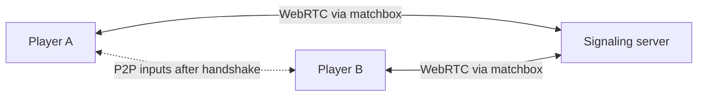

# Rollback netcode

Rollback hides latency by **predicting** remote inputs and playing on at once,
then **rewinding and re-simulating** when the real inputs arrive. Done right,
both players feel like they are playing offline. It works only if every machine
computes bit-identical state from the same inputs, which is the requirement
behind the [deterministic core](deterministic-core.md).

## GGRS — the rollback engine

[GGRS](https://github.com/gschup/ggrs) is a pure-Rust reimplementation of GGPO.
`pf_net` implements its `Config` trait: what travels (`Input`), what is
snapshotted (`World`), and how a peer is addressed (a `usize` handle, until
Phase 3 brings real addresses).

```rust title="crates/pf_net/src/lib.rs"
impl Config for GgrsConfig {
    type Input = Input;
    type State = World;
    type Address = usize;
}
```

`pf_app` never steps `World` itself. Every 60 Hz tick goes through
`pf_net::Session`, which owns a GGRS `P2PSession`, queues one input per local
handle, and fulfils the requests GGRS hands back:

```rust title="crates/pf_net/src/session.rs"
        for (handle, input) in local_inputs {
            self.inner.add_local_input(handle, input)?;
        }
        // ...
        for request in requests {
            match request {
                GgrsRequest::SaveGameState { cell, frame } => {
                    cell.save(frame, Some(world.clone()), Some(world.checksum()));
                }
                GgrsRequest::LoadGameState { cell, .. } => {
                    *world = cell
                        .load()
                        .expect("GGRS asked to load a frame it never saved");
                    advanced.rolled_back = true;
                }
                GgrsRequest::AdvanceFrame { inputs } => {
                    self.frame_inputs.clear();
                    self.frame_inputs
                        .extend(inputs.iter().map(|(input, _)| *input));
                    world.advance(&self.frame_inputs);
                    advanced.frames += 1;
                }
            }
        }
```

Save is `clone()` plus `checksum()`, the checksum being what GGRS compares
between peers. Load is a rewind: GGRS found a misprediction. Advance is one
deterministic tick, and may run several times in one call while GGRS
re-simulates mispredicted frames. GGRS does the prediction, the rollback
decision, and input synchronization; the engine's whole contribution is a pure
`advance`, a cheap `clone`, and a `checksum`.

`Session::advance` reports what it did as `Advanced { frames, rolled_back }`.
When it returns an error or zero frames the world is untouched, because every
error path runs before the first request is fulfilled; `pf_app` logs the error
and draws the last good state. Two GGRS errors, `NotSynchronized` and
`PredictionThreshold`, mean "not this tick" once there are peers and come back
as zero frames rather than errors.

### Local play is the all-local case

`Session::local(n)` registers every handle in `0..n` as `PlayerType::Local` and
starts the `P2PSession` over a `NullSocket` that drops every send and never
receives. With no remote endpoints GGRS skips synchronization, starts Running,
and never rolls back. GGRS defaults stay: input delay 0, prediction window 8,
desync detection off. All three are netplay knobs for Phase 3.

Until Phase 2, `pf_app` called `World::advance` directly; that is the
alternative this replaced. Running local play through the session means Phase
3 adds a transport and remote handles without touching the app loop. The
session changes nothing about the game: `local_session_matches_direct_stepping`
runs 300 scripted frames at 1, 2, 4, and 8 players through both paths and
asserts equal worlds and equal checksums.

## SyncTest — determinism as a CI gate

`run_synctest(num_players, frames)` drives a GGRS `SyncTestSession` with a check
distance of 2: every frame it rolls back two frames, re-simulates them, and
compares checksums. A mismatch is an error naming the frame.

```rust title="crates/pf_net/src/lib.rs"
    let mut session = SessionBuilder::<GgrsConfig>::new()
        .with_num_players(num_players)
        .with_check_distance(2)
        .start_synctest_session()?;
```

The test `determinism_holds_under_rollback` runs it for 300 frames at 1, 2, 4,
and 8 players, and `cargo test --workspace` in `.github/workflows/rust.yml` runs
that on every push and pull request. Inputs come from `scripted_input`: the
stick flips every 20 frames and jump fires every 45, offset per handle, because
a motionless game cannot reveal nondeterminism.

It was wired in Phase 0, before any mechanic existed, because it turns
"mysterious desync three weeks from now" into a failing test on the commit that
broke determinism. What it can and cannot catch is tabled on the
[deterministic core](deterministic-core.md#what-catches-a-violation) page.

## The web netplay trap (and the fix)

GGRS's built-in socket is UDP, and browsers cannot open raw UDP sockets. A
rollback engine without browser netplay would miss one of pfengine's targets.

!!! note "Decided, not built"

    The transport is [matchbox](https://github.com/johanhelsing/matchbox):
    WebRTC sockets that implement GGRS's socket trait on native and web alike.
    One transport serves everywhere, with raw UDP as an optional native-only
    fast path later. This is Phase 3. What the web build already carries so
    that `ggrs` links at all is on
    [Building everywhere](../guide/builds.md#what-the-web-build-carries).


```mermaid
flowchart LR
  A[Player A] <-->|WebRTC via matchbox| SS[Signaling server]
  B[Player B] <-->|WebRTC via matchbox| SS
  A <-.->|P2P inputs after handshake| B
```

| Transport | Native | Browser | Use |
| --- | :---: | :---: | --- |
| matchbox (WebRTC) | ✅ | ✅ | **Default — works everywhere** |
| GGRS UDP | ✅ | ❌ | Optional native-only fast path |

## Couch + online

A session is a set of player handles, each **local** or **remote**. Two machines
playing doubles register the same four handles from opposite sides:

| Handle | Machine A | Machine B |
| :---: | --- | --- |
| 0, 1 | local | remote |
| 2, 3 | remote | local |

GGRS wants one input per *local* handle before each `advance_frame`; nothing
else changes. `Session::local_handles()` lists the handles this machine
supplies, and `pf_app` passes that list to `Slots::new`, so the slot binder
knows which slots are local. A source pressing jump claims the lowest free
*local* slot; a keyboard can never claim a remote fighter. Remote slots always
emit `Input::default()` from the binder, since their input arrives through the
session, and the HUD labels them "remote".

**The cap counts machines, not fighters.** `MAX_NETPLAY_MACHINES = 4`, and
`check_netplay_machines` will gate the Phase 3 constructor; local sessions and
SyncTest have no cap. Links run between machines and every peer waits on the
laggiest one, so the link count is what the cap bounds. The earlier fighter cap
was reversed
([dev log](../devlog.md#2026-09-04-local-play-runs-through-ggrs)):
re-simulation cost scales with fighters, and the sim is cheap until Phase 5
adds real mechanics. A fighter ceiling may return then. GGRS fixes the roster
when a session starts, so which machine owns which handles is the lobby's
decision, and handle numbers follow that split rather than join order.

## What travels over the wire

Only inputs, never state. Both sides run the identical simulation, so identical
inputs reproduce identical state; that keeps bandwidth to a few bytes per
player per frame and leaves a state-editing cheat nothing to send.

```rust title="crates/pf_core/src/input.rs"
#[derive(Clone, Copy, PartialEq, Eq, Hash, Debug, Default, Serialize, Deserialize)]
pub struct Input {
    pub buttons: u16,
    pub stick_x: i8,
    pub stick_y: i8,
    pub cstick_x: i8,
    pub cstick_y: i8,
}
```

The sticks are quantized to `i8`, so analog fidelity is fixed at the boundary
and never depends on a controller driver. The serde derives are GGRS's
requirement: version 0.11's `Config::Input` demands
`Serialize + DeserializeOwned + Default`. The first plan was `bytemuck::Pod`,
and it lost to that requirement
([dev log](../devlog.md#2026-06-07-phase-0-scaffold-complete)); `fixed` carries
its `serde` feature for the same reason.

## Input sources

Where an `Input` comes from is the platform layer's job. `pf_app` defines the
seam:

```rust title="crates/pf_app/src/input.rs"
pub trait InputSource {
    fn poll(&mut self) -> Input;
    /// Short name for the HUD.
    fn label(&self) -> &str;
}
```

`poll` takes `&mut self` because gamepad backends pump events on poll.
`keyboard_sources()` returns four layouts, each a left/right pair that drives
`stick_x` to ±110 and a jump key. `Slots::tick` polls every source each tick; a
rising edge on jump from an unassigned source claims the lowest free local
slot, and that press is swallowed so joining does not also jump. Because only
`Input` crosses into `pf_core`, no controller can affect determinism.

**Decided, not built** (Phase 4): standard gamepads through
[`gilrs`](https://github.com/gabomdq/gilrs) on native and the
[Gamepad API](https://developer.mozilla.org/docs/Web/API/Gamepad_API) on web;
the GameCube adapter (WUP-028) over USB-HID natively and
[WebHID](https://developer.mozilla.org/docs/Web/API/WebHID_API) in the
browser; and analog calibration (deadzones, notch and edge clamping, the Melee
coordinate feel), which happens before quantization to the `i8` fields.

## Replays — determinism's other dividend

**Decided, not built** (recording in Phase 2, the viewer in Phase 6). Because
the sim is a pure function of its inputs, a replay is the initial seed, the
match config, and the per-frame input stream: the [Slippi](https://slippi.gg)
model. Play it through the same `advance` and the match reproduces
bit-for-bit. The per-frame `checksum()` doubles as a playback validator, and a
sim-version hash in the header keeps engine changes from silently invalidating
old files. The seam already exists: every frame's inputs pass through the
advance-frame arm of `Session::advance`, and `confirmed_frame()` says which of
them are final.
