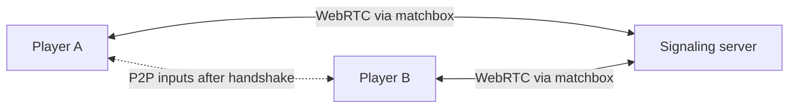

# Rollback netcode

Rollback hides latency. Each machine **predicts** the remote inputs and plays
on at once, then **rewinds and re-simulates** when the real inputs arrive.
Done well, every player feels as if the game were offline. It works only if
every machine computes bit-identical state from the same inputs, which is the
job of the [deterministic core](deterministic-core.md).

## GGRS — the rollback engine

[GGRS](https://github.com/gschup/ggrs) is a pure-Rust reimplementation of
GGPO. `pf_net` implements its `Config` trait, which names three types: what
travels over the wire (`Input`), what gets snapshotted (`World`), and how a
peer is addressed (a `usize` handle, until Phase 3 brings real addresses).

```rust title="crates/pf_net/src/lib.rs"
impl Config for GgrsConfig {
    type Input = Input;
    type State = World;
    type Address = usize;
}
```

`pf_app` never steps `World` itself. Every 60 Hz tick goes through
`pf_net::Session`, which owns a GGRS `P2PSession`. `Session::advance` queues
one input per local handle, then carries out the requests GGRS hands back:

```rust title="crates/pf_net/src/session.rs"
        for (handle, input) in local_inputs {
            self.inner.add_local_input(handle, input)?;
        }
        // ...
        for request in requests {
            match request {
                GgrsRequest::SaveGameState { cell, frame } => {
                    cell.save(frame, Some(world.clone()), Some(world.checksum()));
                }
                GgrsRequest::LoadGameState { cell, .. } => {
                    *world = cell
                        .load()
                        .expect("GGRS asked to load a frame it never saved");
                    advanced.rolled_back = true;
                }
                GgrsRequest::AdvanceFrame { inputs } => {
                    self.frame_inputs.clear();
                    self.frame_inputs
                        .extend(inputs.iter().map(|(input, _)| *input));
                    world.advance(&self.frame_inputs);
                    advanced.frames += 1;
                }
            }
        }
```

- **Save** is `clone()` plus `checksum()`. The checksum is what GGRS compares
  between peers.
- **Load** is a rewind: GGRS found a misprediction.
- **Advance** is one deterministic tick. One call can run it several times
  while GGRS re-simulates mispredicted frames.

GGRS handles the prediction, the decision to roll back, and input
synchronization. The engine supplies only a pure `advance`, a cheap `clone`,
and a `checksum`.

`Session::advance` reports what it did as `Advanced { frames, rolled_back }`.
When it returns an error or zero frames, the world is untouched, because
every error path runs before the first request is fulfilled. `pf_app` logs
the error and draws the last good state.

Two cases mean "not this tick" once there are peers, and both return zero
frames rather than an error. `NotSynchronized` means peers are still syncing.
A session too far ahead of its peers gets requests with no `AdvanceFrame`.
(`Session::advance` also maps `PredictionThreshold` to zero frames, but only
GGRS's spectator session returns that error.)

### Local play is the all-local case

`Session::local(n)` registers every handle in `0..n` as `PlayerType::Local`
and starts the `P2PSession` over a `NullSocket`, which drops every send and
never receives. With no remote endpoints, GGRS skips synchronization, starts
in the Running state, and never rolls back. The GGRS defaults stay: input
delay 0, prediction window 8, desync detection off. All three are netplay
knobs for Phase 3.

Until Phase 2, `pf_app` called `World::advance` directly. Routing local play
through the session replaced that, so Phase 3 can add a transport and remote
handles without touching the app loop. The session does not change the game:
`local_session_matches_direct_stepping` runs 300 scripted frames at 1, 2, 4,
and 8 players down both paths and asserts equal worlds and equal checksums.

## SyncTest — determinism as a CI gate

`run_synctest(num_players, frames)` drives a GGRS `SyncTestSession` with a
check distance of 2. Past frame 2, every frame it rolls back two frames,
re-simulates them, and compares their checksums with the first run. A
mismatch returns an error that names the frame.

```rust title="crates/pf_net/src/lib.rs"
    let mut session = SessionBuilder::<GgrsConfig>::new()
        .with_num_players(num_players)
        .with_check_distance(2)
        .start_synctest_session()?;
```

The test `determinism_holds_under_rollback` runs it for 300 frames at 1, 2,
4, and 8 players. The `cargo test --workspace` step in
`.github/workflows/rust.yml` runs that test on every push to `main` and every
pull request. Inputs come from `scripted_input`: the stick flips every 20
frames and jump fires every 45, offset per handle. A motionless game cannot
reveal nondeterminism, so the script keeps every fighter moving.

SyncTest went in during Phase 0, alongside the first physics slice and before
any fighting mechanic. A break in determinism then fails a test on the commit
that caused it, instead of surfacing as a desync weeks later. The
[deterministic core](deterministic-core.md#what-catches-a-violation) page
tables what it can and cannot catch.

## The web netplay trap (and the fix)

GGRS's built-in socket is UDP, and browsers cannot open raw UDP sockets. A
rollback engine without browser netplay would miss one of pfengine's targets.

!!! note "Decided, not built"

    The transport is [matchbox](https://github.com/johanhelsing/matchbox):
    WebRTC sockets that implement GGRS's socket trait on native and web
    alike. One transport serves every platform, with raw UDP as an optional
    native-only fast path later. This is Phase 3. What the web build already
    carries so that `ggrs` builds and loads in the browser is on
    [Building everywhere](../guide/builds.md#what-the-web-build-carries).


```mermaid
flowchart LR
  A[Player A] <-->|WebRTC via matchbox| SS[Signaling server]
  B[Player B] <-->|WebRTC via matchbox| SS
  A <-.->|P2P inputs after handshake| B
```

| Transport | Native | Browser | Use |
| --- | :---: | :---: | --- |
| matchbox (WebRTC) | ✅ | ✅ | **Default — works everywhere** |
| GGRS UDP | ✅ | ❌ | Optional native-only fast path |

## Couch + online

A session is a set of player handles, each **local** or **remote**. Two
machines playing doubles register the same four handles from opposite sides:

| Handle | Machine A | Machine B |
| :---: | --- | --- |
| 0, 1 | local | remote |
| 2, 3 | remote | local |

Phase 3 adds the constructor that registers remote handles; the local side
runs today. GGRS wants one input per *local* handle before each
`advance_frame`, and nothing else changes. `Session::local_handles()` lists
the handles this machine supplies, and `pf_app` passes that list to
`Slots::new`, so the slot binder knows which slots are local. A source that
presses jump claims the lowest free *local* slot, so a keyboard can never
claim a remote fighter. The binder always emits `Input::default()` for a
remote slot, because that slot's input arrives through the session, and the
HUD labels it "remote".

**The cap counts machines, not fighters.** `MAX_NETPLAY_MACHINES` is 4, and
`check_netplay_machines` will gate the Phase 3 constructor. Local sessions and
SyncTest have no cap. Links run between machines, and every peer waits on the
laggiest one, so the cap bounds the number of links. It reverses an earlier
cap on fighters
([dev log](../devlog.md#2026-09-04-local-play-runs-through-ggrs)):
re-simulation cost scales with fighters, and the sim stays cheap until
Phase 5 adds real mechanics. A fighter ceiling may return then.

GGRS fixes the roster when a session starts. So the lobby decides which
machine owns which handles, and handle numbers follow that split rather than
join order.

## What travels over the wire

Only inputs, never state. Both sides run the same simulation, so the same
inputs reproduce the same state. That keeps bandwidth to a few bytes per
player per frame, and a cheat that edits state has nothing to send.

```rust title="crates/pf_core/src/input.rs"
#[derive(Clone, Copy, PartialEq, Eq, Hash, Debug, Default, Serialize, Deserialize)]
pub struct Input {
    pub buttons: u16,
    pub stick_x: i8,
    pub stick_y: i8,
    pub cstick_x: i8,
    pub cstick_y: i8,
}
```

The sticks are quantized to `i8`, so the sim's analog precision is fixed at
this boundary and does not depend on any controller driver. The serde derives
are there because GGRS requires them: in version 0.11, `Config::Input` must be
`Serialize + DeserializeOwned + Default`. The first plan was `bytemuck::Pod`,
and it lost to that requirement
([dev log](../devlog.md#2026-06-07-phase-0-scaffold-complete)). The same
decision gave `fixed` its `serde` feature.

## Input sources

Turning a device into an `Input` is the platform layer's job. `pf_app`
defines the seam:

```rust title="crates/pf_app/src/input.rs"
pub trait InputSource {
    fn poll(&mut self) -> Input;
    /// Short name for the HUD.
    fn label(&self) -> &str;
}
```

`poll` takes `&mut self` because gamepad backends pump events on poll.
`keyboard_sources()` returns four layouts, each a left/right pair that drives
`stick_x` to ±110, plus a jump key. `Slots::tick` polls every source each
tick. A rising edge on jump from an unassigned source claims the lowest free
local slot, and the binder swallows that press so joining does not also jump.
Only `Input` crosses into `pf_core`, so no controller can affect determinism.

**Decided, not built** (Phase 4): standard gamepads through
[`gilrs`](https://github.com/gabomdq/gilrs) on native and the
[Gamepad API](https://developer.mozilla.org/docs/Web/API/Gamepad_API) on web;
the GameCube adapter (WUP-028) over USB-HID natively and
[WebHID](https://developer.mozilla.org/docs/Web/API/WebHID_API) in the
browser; and analog calibration (deadzones, notch and edge clamping, the Melee
coordinate feel), applied before quantization to the `i8` fields.

## Replays — determinism's other dividend

**Decided, not built** (recording in Phase 2, the viewer in Phase 6). The sim
is a pure function of its inputs, so a replay is the initial seed, the match
config, and the per-frame input stream: the [Slippi](https://slippi.gg)
model. Played through the same `advance`, the stream reproduces the match bit
for bit. Checksums recorded periodically alongside it validate playback, and
a sim-version hash in the header keeps engine changes from silently
invalidating old files. The seam already exists: every frame's inputs pass
through the advance-frame arm of `Session::advance`, and `confirmed_frame()`
says which of them are final.
